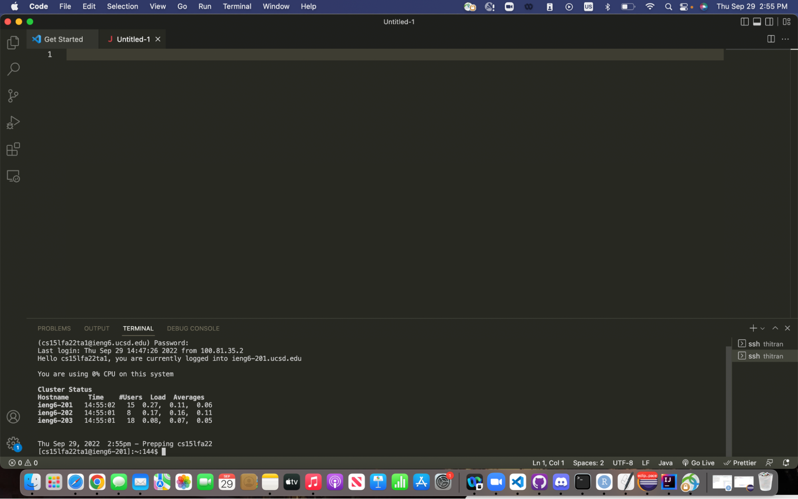
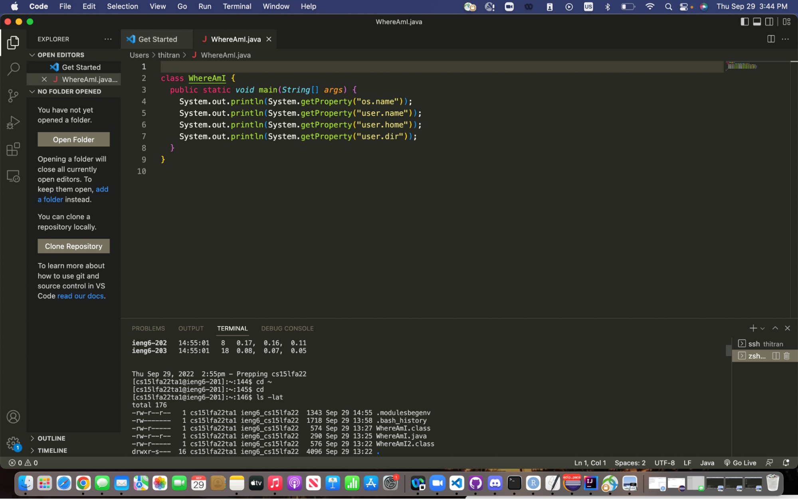
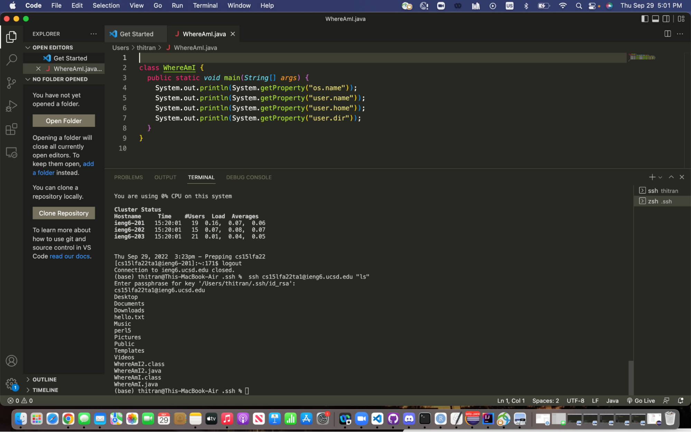
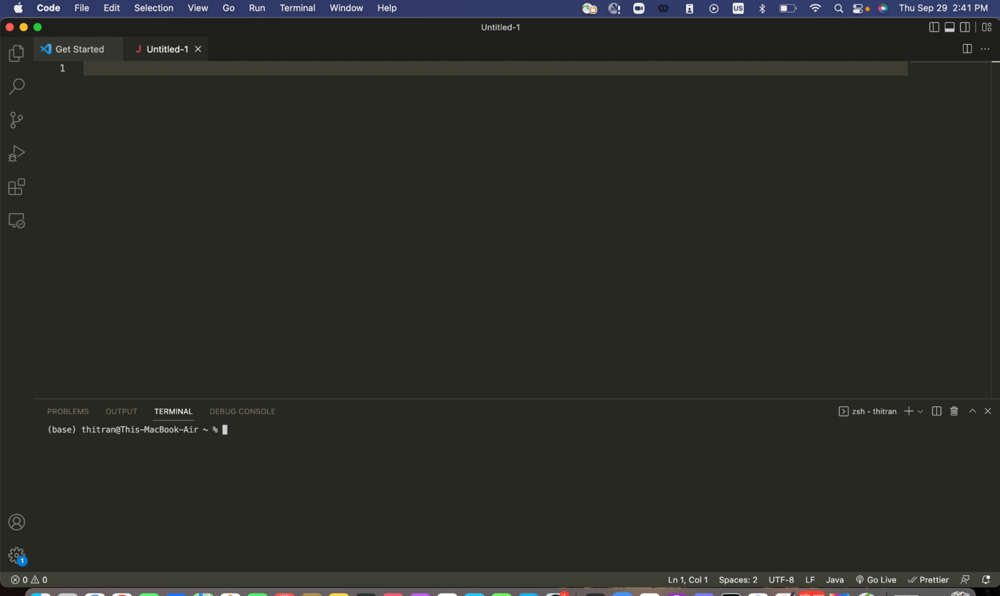
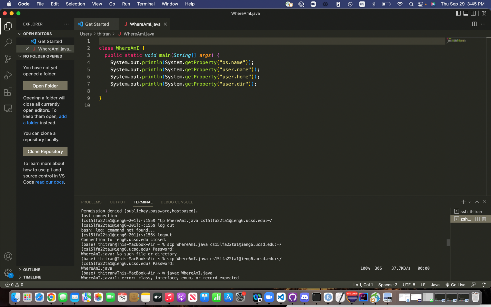
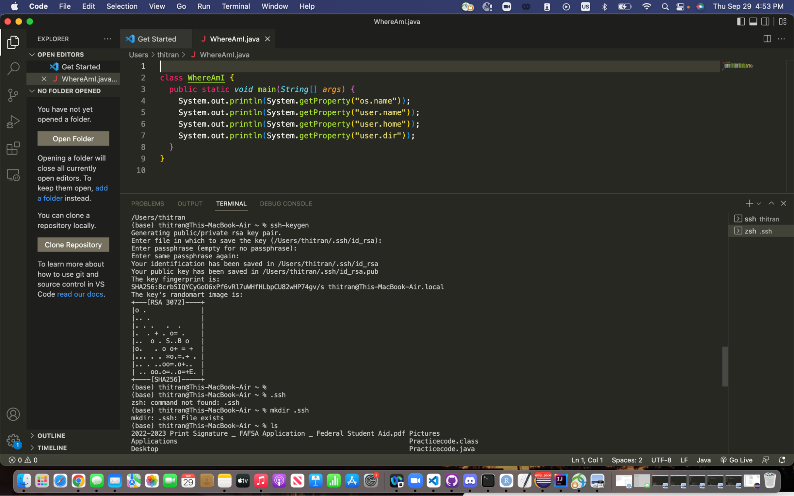

Name: Thi Tran PID: A16211852

1. Installing VScode
   I have installed Visual Studio Code before so this process is quite easy for me. First, I searched VSCode on Google and clicked download that matches with my Operational Systems.

2. Remotely Connecting
   I have installed Visual Studio Code before so this process is quite easy for me. First, I searched VSCode on Google and clicked download that matches with my Operational Systems.

   First of all, I created a new password using the provided link from the CSE15L page. I waited for a while(approximately more than 15 mins) to log into the terminal. Unfortunately, the terminal was not working. I was denied permission access after trying to enter the password multiple times. For that reason, I used the TA account and it worked as I had screenshot it below.
   

3. Trying Some Commands
   After using the TA account, I was successfully connected. I input some commands into the terminal(using the example one that was provided). Below is the screenshot that I was able to run in the terminal.
   

4. Moving Files with scp
   I couldn’t be able to run the file at first because I was using the wrong username. Even though I corrected myself using the right username, I was not getting the correct files. After a while, I learned that I called the file within the same file(see below) which was why it was unsuccessful. After fixing those mistakes, I ran the program again and it worked.
   
5. Setting an SSH Key
   First, I typed ssh-keygen on my terminal. Then, I clicked return one more time as I wanted to put a password on my terminal and it worked. While it was being saved, I typed mkdir .ssh in order to search if the files exist or not. As expected, it is located on my computer. I successfully set an SSH key that can use more in my future use.
   
6. Optimizing Remote Running
   I run the ssh command using the given format. As a result, I only need to input a password into the terminal and it quickly runs into the file. I don’t need to type long commands in order get into the file and server.
   
