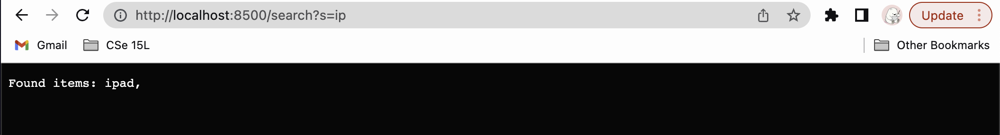

Part 1: Simplest Search Engine

Code Block:
import java.io.IOException;
import java.net.URI;

class Handler implements URLHandler {
// The one bit of state on the server: a number that will be manipulated by
// various requests.av
int num = 0;

    public String handleRequest(URI url) {
        if (url.getPath().equals("/")) {
            return String.format("Number: %d", num);
        } else if (url.getPath().equals("/increment")) {
            num += 1;
            return String.format("Number incremented!");
        } else {
            System.out.println("Path: " + url.getPath());
            if (url.getPath().contains("/add")) {
                String[] parameters = url.getQuery().split("=");
                if (parameters[0].equals("count")) {
                    num += Integer.parseInt(parameters[1]);
                    return String.format("Number increased by %s! It's now %d", parameters[1], num);
                }
            }
            return "404 Not Found!";
        }
    }

}

class NumberServer {
public static void main(String[] args) throws IOException {
if (args.length == 0) {
System.out.println("Missing port number! Try any number between 1024 to 49151");
return;
}

        int port = Integer.parseInt(args[0]);

        Server.start(port, new Handler());
    }

}

;
The search Enginee works as expected.

The methods are called: getPath(), getQuery(), split(), equals(), add(), String.format().
equals("/") equals("/add") getQuery().split("=") equals("s") String.format("Item added!")
;
;
;
;

For the search Query, I added the Search method to check the items inside the array(/search). When I (/search), it will go through the URL command and search through the word that I had added.
;

When there is not element (==0), then this search Query will not execute. Therefore, it will return to ("Command do not found"). Moreover, when (/) in the local host, it will show all of the words that it added( like an array list).
;
;

All of these values are change when I manually add/search command on the server.
The methods are called: getPath(), getQuery(), split(), equals(), contains(), String.format()

Part 2: Find Bugs and Debugs

1. Failure Inducing-Input

;
Symptoms: The reversed test was expected <8> but was return <0> because the array didn't reversed the value as it mentioned in the function.

;

Symptoms: The Reversed In Place Test was supposed to update index 2 and index 0 when it reversed. However, the value didn't update or keep the old values.

;
Symptoms: The bug was expected [school, stressful] but was [stressful, school] when it searched for the string("s"). It only returns normal elements and not filtered the elements in the array.

Fixed Code:

;
Symptoms:

;

Symptoms:

;
