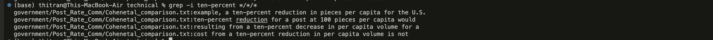
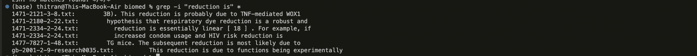
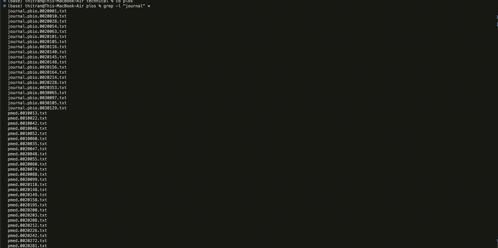
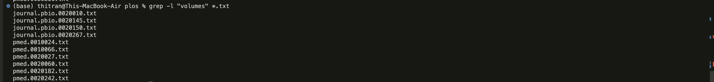
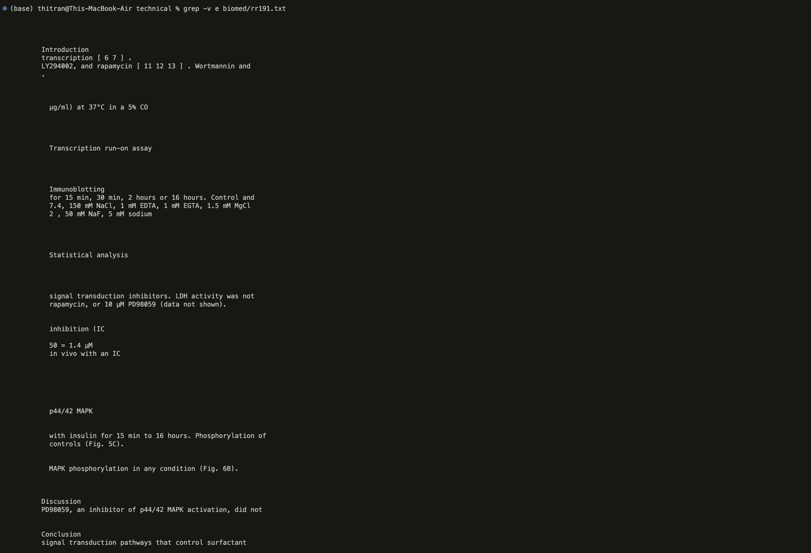
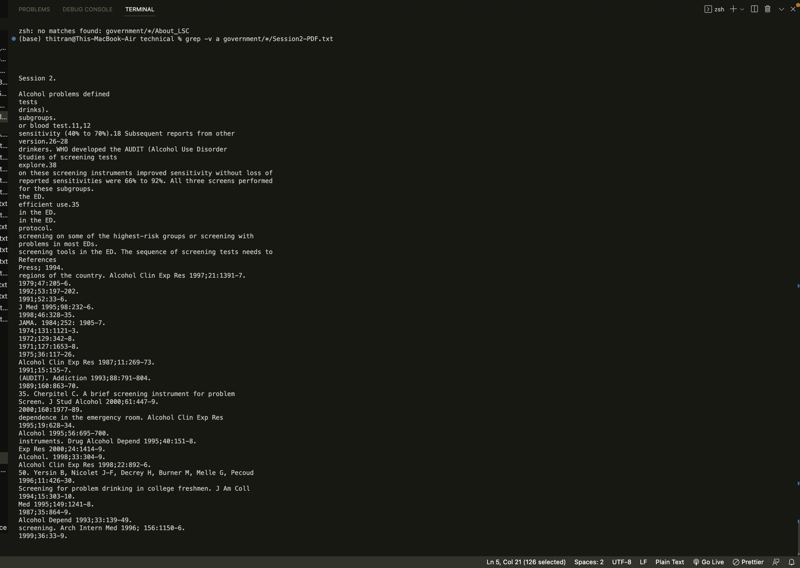
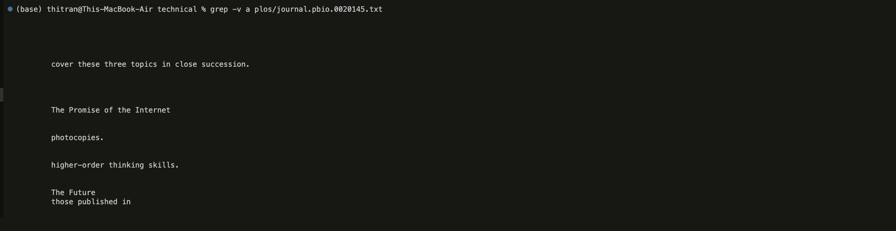

Week 5 Lab Report

--> -i : ignores the text cases and search through files that have that phrase in the command.

1. grep -i ten-percent\*

   This command ignores all the cases and find text files that includes “ten-percent” in their files. It prints out in the terminal below.

   

2. grep -i "socially" \*.txt

   When entering into the biomed files, I searched the key word socially in the existing files while ignoring all the rest.

   

3. grep -i "reduction is" \*

   This ignores all the files that have the phrase “reduction is” . This is helpful when you try to find keyword in a large document because it will fast and convenient to ignore all irrelevant files.

   

   --> -l : search first files or words that might appear in the files.

4. grep -l "Helping" \*

   This grep -l command displays the files patterns in the searching quotation. This will be helpful when trying to find notes in the directory system.

   

5. grep -l "journal" \*

   This will sort out all the find with that has “journal” once in their list.

   

6. grep -l "volumes" \*.txt

   This command searches for “volume” in all the files that exist.

   

   --> -v : search lines that do not include the given letters/words/phrase.

7. grep -v e biomed/rr191.txt

   This command will search all the line in biomed/rr191.txt that do not have e. This search will also show up in the terminal even if it’s empty.

   

8. grep -v a government/\*/Session2-PDF.txt

   This command helps eliminate lines that have “a” in the Sesssion2-PDF.txt file. It is helpful because if we want to eliminate something, then we can utilize this supported command.

   

9. grep -v a plos/journal.pbio.0020145.txt

   This command searches "a" element in the journal.pbio.0020145.txt inside the subfolder plos of /technical. In the terminal, it will not print out any words that have a. Instead, it prints empty words and all words without "a".

   
