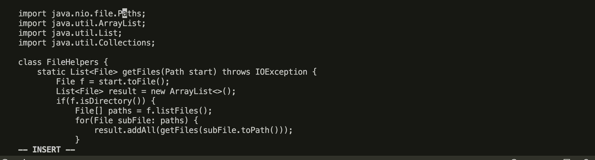
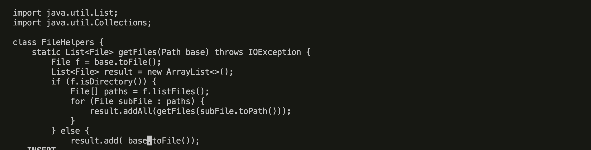

Part 1:

1. vim DocSearchServer.java <Enter>
   
2. /start <Enter> (this will search the word start inside the file)
3. <i> (insert the word and make edit from start to base) <esc>
4. n. (searching for the word start)
5. <i> (insert the word and make edit from start to base) <esc>
6. n.
7. <i> (insert the word and make edit from start to base) <esc>
   
8. Shift zz (this will save all the edits and back to the terminal.
   

Part 2:

Edit in VSCode: 40 seconds
Edit in Vim : Roughly 25 seconds

Question 1:Which of these two styles would you prefer using if you had to work on a program that you were running remotely, and why?
For now, I am more familiar with using VSCode so I would prefer using it to run my program. It might not be time-efficient and difficult in switch files like vim but once I get used with all the commands in vim, I would definitely prefer vim to maximize time-efficency.

Question 2: What about the project or task might factor into your decision one way or another? (If nothing would affect your decision, say so and why!)
With a larger project, I will prefer to use Visual Studio Code. It's easier to view and switch files in the folders comparing to Vim.
